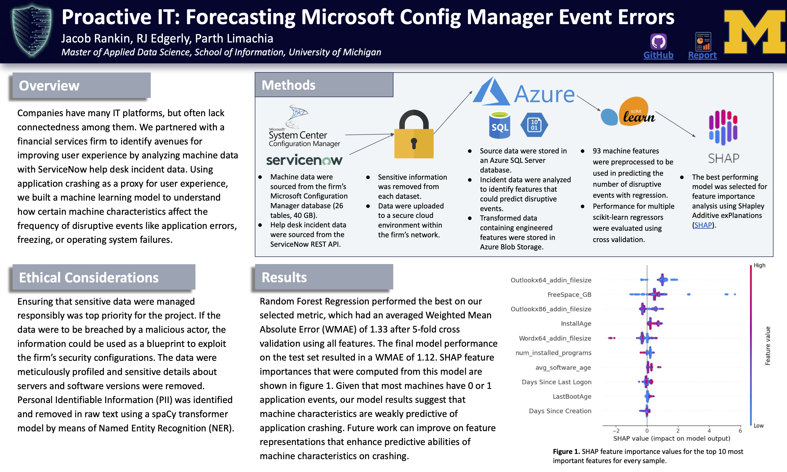

# Proactive IT: forecasting Microsoft Configuration Manager event errors
University of Michigan Master of Applied Data Science Spring/Summer 2023 Capstone Project

Jacob Rankin, RJ Edgerly, Parth Limachia


## About the Project
Information technology delivery is an evolving challenge for organizations. Deploying IT solutions for thousands of employees across a range of geographies involves complex issues and unexpected errors. Proactive monitoring of hardware and software assets across an organization can help identify such issues and implement resolutions to minimize impact to the business. Our project aims to apply machine learning on hardware, software, and service desk data from a mid-size organization with the goal of improving client services delivery at the firm.

## Results

Using 93 engineered features derived from Microsoft Configuration Manager and ServiceNow data, we evaluated multiple scikit-learn regressors via 5-fold cross validation. **Random Forest Regression** achieved the best performance with a Weighted Mean Absolute Error (WMAE) of **1.12** on the held-out test set. SHAP analysis revealed that application add-in file sizes, install age, and software inventory metrics were the most influential predictors of disruptive events.



## Usage Limitations
All are welcome to use this repository as a starting point for future IT data science projects. The underlying data, however, cannot be redistributed due to their sensitivity. 

## Getting Started
Follow the instructions below for getting a local copy running on your machine.

### Installation
1. Clone the repo.
   ```
   git clone https://github.com/redgerly-umich/capstone_ff.git
   ```
2. Install and set up the project dependencies using the requirements.txt file, which is found in the ff_env directory:
   ```
   pip install -r requirements.txt
   ```
